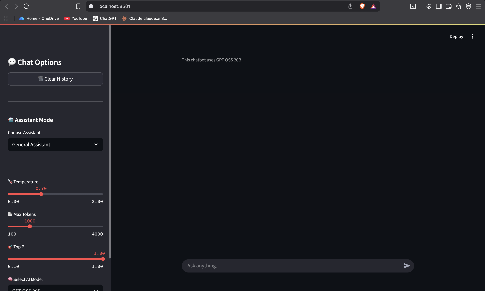
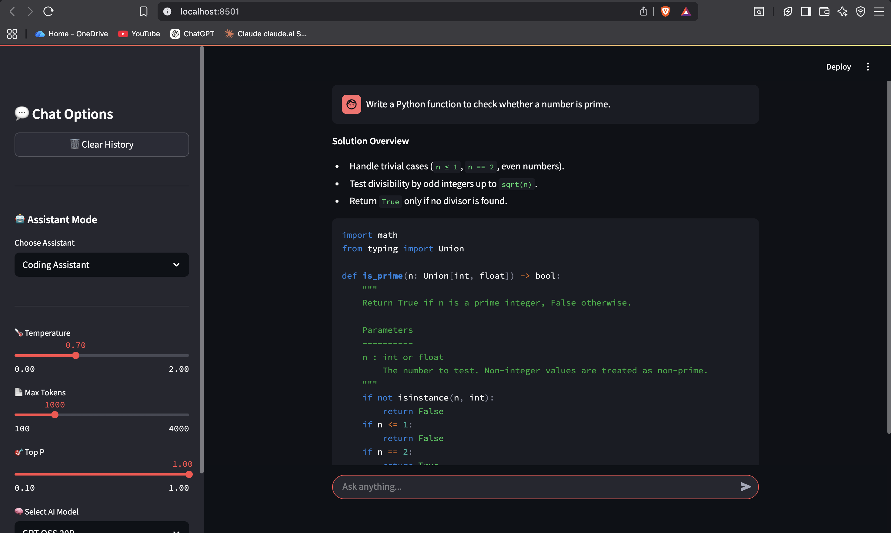
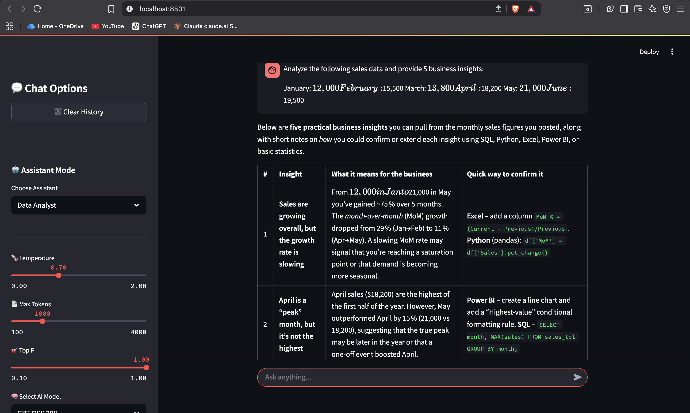
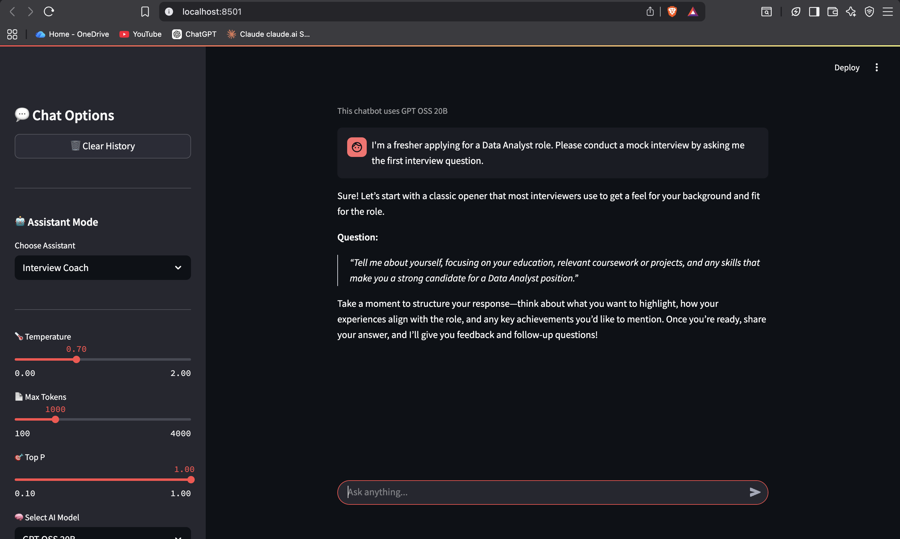

# 🤖 AI Career Assistant


An AI-powered Career Assistant built with **Python**, **Streamlit**, and **Groq API**. The application provides multiple AI assistant modes including a General Assistant, Coding Assistant, Data Analyst Assistant, and Interview Coach through a clean and interactive web interface.

---

## 🌐 Live Demo
### 👉 https://ai-career-assistant-ddggegpdq5byoejq8tirhp.streamlit.app/

# 🚀 Project Highlights

- 🤖 Multi-role AI Assistant
- 💬 Real-time streaming responses
- 🧠 Prompt Engineering for different assistant modes
- 📊 Data Analyst Assistant
- 💻 Coding Assistant
- 🎤 Interview Coach
- 🗑️ Chat History Management
- ⚙️ Configurable AI Parameters
- 📱 Responsive Streamlit UI
- 🔒 Environment Variable Security

---

# 🧠 Project Overview

AI Career Assistant is a Streamlit-based chatbot that uses the Groq API to deliver fast and interactive AI conversations.

Unlike a basic chatbot, this application supports multiple assistant personalities, allowing users to switch between different professional use cases without changing the underlying application.

The project demonstrates modern AI application development by combining prompt engineering, session memory, modular architecture, and interactive user interfaces.

---

# 🎯 Project Objectives

- Build a real-world AI chatbot application
- Learn API integration with Large Language Models
- Implement Prompt Engineering
- Create reusable project architecture
- Improve user interaction using Streamlit
- Demonstrate AI application deployment skills

---

# ✨ Features

### 🤖 General Assistant

- General knowledge
- Summaries
- Explanations
- Writing assistance

---

### 💻 Coding Assistant

- Python
- SQL
- Java
- C++
- Debugging
- Code Explanation
- Algorithm Design

---

### 📊 Data Analyst Assistant

- SQL Queries
- Power BI
- DAX
- Excel
- Python
- Business Insights
- KPI Analysis

---

### 🎤 Interview Coach

- HR Interview Questions
- Technical Questions
- Resume Guidance
- Mock Interviews
- Career Advice

---

### ⚙️ Additional Features

- Streaming AI Responses
- Adjustable Temperature
- Adjustable Max Tokens
- Adjustable Top-P
- Session Memory
- Clear Chat History
- Modular Codebase

---

# 🛠 Tech Stack

| Technology | Purpose |
|------------|----------|
| Python | Programming Language |
| Streamlit | Web Application |
| Groq API | Large Language Model |
| Prompt Engineering | AI Response Control |
| dotenv | Environment Variables |
| Git | Version Control |
| GitHub | Repository Hosting |

---

# 📂 Project Structure

```
AI-Career-Assistant/
│
├── assets/
│   ├── home.png
│   ├── coding-assistant.png
│   ├── data-analyst.png
│   └── interview-coach.png
│
├── chatbot/
│   ├── client.py
│   ├── config.py
│   ├── memory.py
│   └── prompts.py
│
├── utils/
│   └── constants.py
│
├── app.py
├── requirements.txt
├── .env.example
├── .gitignore
└── README.md
```

---

# 📸 Application Preview

## 🏠 Home Page



---

## 💻 Coding Assistant



---

## 📊 Data Analyst Assistant



---

## 🎤 Interview Coach



---

# 🧠 Prompt Engineering

The chatbot uses dedicated system prompts for different assistant roles.

- General Assistant
- Coding Assistant
- Data Analyst
- Interview Coach

This allows the same LLM to behave differently depending on the selected assistant mode.

---

# ⚙️ Installation

Clone the repository

```bash
git clone https://github.com/shubhamraj-65/AI-Career-Assistant.git
```

Go to the project folder

```bash
cd AI-Career-Assistant
```

Install dependencies

```bash
pip install -r requirements.txt
```

Create a `.env` file

```env
groq_api_key=YOUR_API_KEY
```

Run the application

```bash
streamlit run app.py
```

---

# 💡 Example Use Cases

### Coding

- Generate code
- Debug programs
- Explain algorithms
- SQL Queries

---

### Data Analytics

- KPI Analysis
- Dashboard Insights
- Business Recommendations
- DAX Help

---

### Interview Preparation

- HR Interviews
- Technical Interviews
- Resume Questions
- Behavioral Questions

---

### Productivity

- Summaries
- Brainstorming
- Writing
- Learning

---

# 📈 Skills Demonstrated

- Prompt Engineering
- LLM Integration
- API Development
- Streamlit Development
- Session Management
- Modular Python Architecture
- Environment Variable Management
- Git & GitHub
- Software Project Organization

---

# 🚀 Future Improvements

- User Authentication
- Chat Export (PDF)
- Voice Input
- Voice Output
- Image Understanding
- Document Upload
- Conversation Search
- Multiple LLM Support
- Dark/Light Theme
- Chat History Database
- RAG Integration
- Deployment on Streamlit Cloud

---

# 👨‍💻 Author

**Shubham Raj**

📧 Email:
shubhamraj.1937@gmail.com

🔗 GitHub:
https://github.com/shubhamraj-65

---

# ⭐ Support

If you found this project useful, consider giving it a ⭐ on GitHub.

It helps others discover the project and motivates future improvements.

---

**Made with ❤️ using Python, Streamlit, and Groq API**
