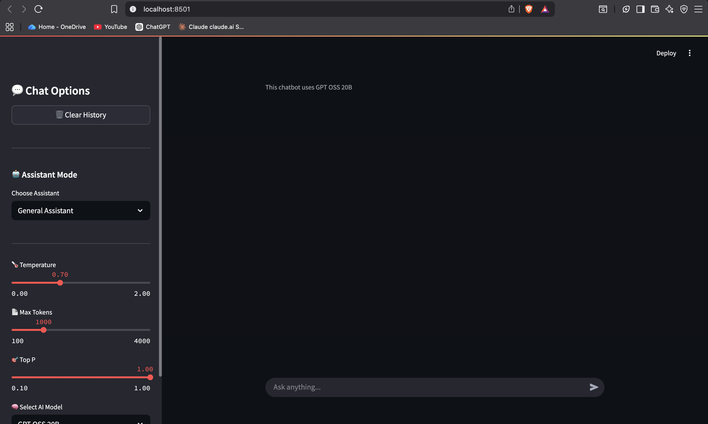
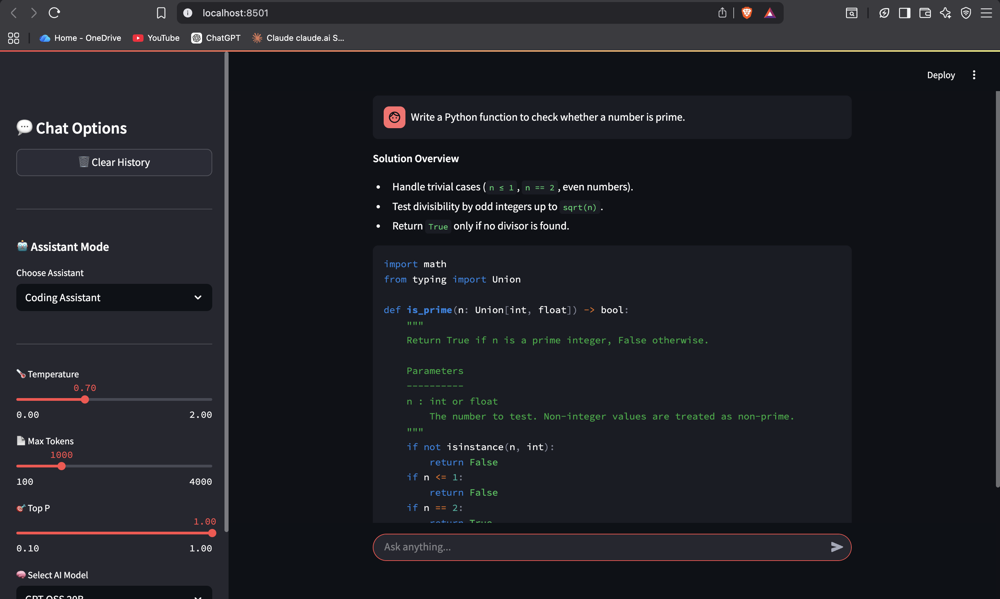
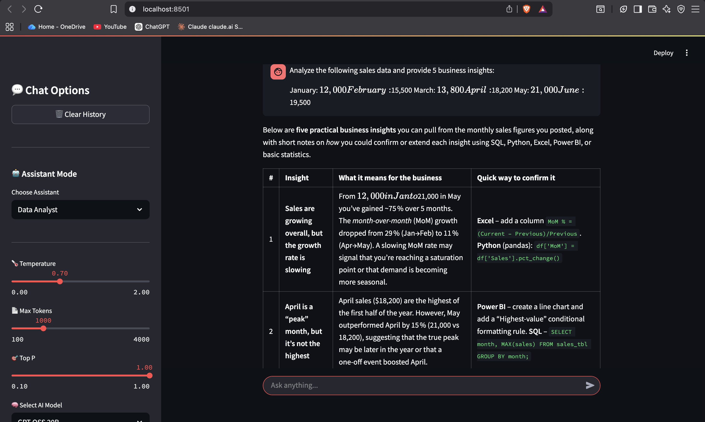
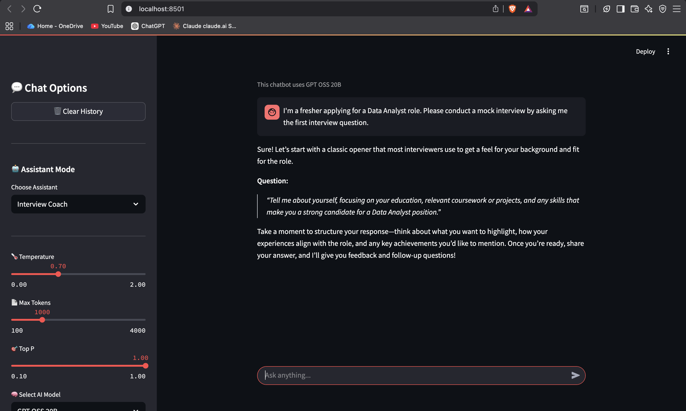

# 🤖 AI Career Assistant

<div align="center">


### 🚀 An AI-powered Career Assistant built using Python, Streamlit, Prompt Engineering, and Groq LLM API.

**One platform for Coding, Data Analytics, Interview Preparation, and Career Guidance.**

</div>

---

# 🌐 Live Demo
### 👉 https://ai-career-assistant-ddggegpdq5byoejq8tirhp.streamlit.app/
> No installation required. Open the link and start chatting with your AI Career Assistant instantly.

---

# 📊 Project Metrics


| Metric | Value |
|---------|-------|
| AI Assistant Modes | 4 |
| Programming Language | Python |
| LLM Provider | Groq |
| Framework | Streamlit |
| Deployment | Streamlit Cloud |
| Response Mode | Real-Time Streaming |
| Prompt Engineering | Yes |
| Session Memory | Yes |

# 🚀 Project Highlights

- 🤖 Multi-role AI Assistant
- 💬 Real-time streaming responses
- 🧠 Prompt Engineering for different assistant modes
- 📊 Data Analyst Assistant
- 💻 Coding Assistant
- 🎤 Interview Coach
- 🗑️ Chat History Management
- ⚙️ Configurable AI Parameters
- 📱 Responsive Streamlit UI
- 🔒 Environment Variable Security

---

# 📌 Project Overview

Artificial Intelligence is transforming how people learn, work, and prepare for their careers. However, most AI tools focus on only one task, requiring users to switch between multiple applications for coding, interview preparation, analytics, and career guidance.

**AI Career Assistant** solves this problem by combining multiple AI assistants into a single application.

Users can switch between specialized assistant modes while enjoying a fast, interactive, and user-friendly experience powered by the Groq LLM API.

---

# ❓ Business Problem

Students, job seekers, and professionals often rely on different platforms for:

- Coding assistance
- SQL queries
- Data analytics guidance
- Interview preparation
- Resume support
- Career advice

Using multiple applications interrupts productivity, increases learning time, and creates an inconsistent experience.

---

# 💡 Solution

AI Career Assistant brings all essential career-focused AI services into one platform.

The application intelligently changes its behavior using Prompt Engineering, allowing users to interact with different assistant personalities without changing applications.

Available assistant modes include:

- 🤖 General Assistant
- 💻 Coding Assistant
- 📊 Data Analyst Assistant
- 🎤 Interview Coach

---

# 🎯 Key Benefits

✔ One application for multiple career needs

✔ Faster career preparation

✔ Coding and debugging assistance

✔ SQL, Power BI, Excel & Python guidance

✔ Mock interview preparation

✔ Career advice and resume support

✔ Real-time AI responses

✔ Demonstrates practical LLM integration

---

# 🎯 Project Objectives

- Build a real-world AI chatbot application
- Learn API integration with Large Language Models
- Implement Prompt Engineering
- Create reusable project architecture
- Improve user interaction using Streamlit
- Demonstrate AI application deployment skills

---

# ✨ Features

### 🤖 General Assistant

- General knowledge
- Summaries
- Explanations
- Writing assistance

---

### 💻 Coding Assistant

- Python
- SQL
- Java
- C++
- Debugging
- Code Explanation
- Algorithm Design

---

### 📊 Data Analyst Assistant

- SQL Queries
- Power BI
- DAX
- Excel
- Python
- Business Insights
- KPI Analysis

---

### 🎤 Interview Coach

- HR Interview Questions
- Technical Questions
- Resume Guidance
- Mock Interviews
- Career Advice

---

### ⚙️ Additional Features

- Streaming AI Responses
- Adjustable Temperature
- Adjustable Max Tokens
- Adjustable Top-P
- Session Memory
- Clear Chat History
- Modular Codebase

---

# 🛠 Tech Stack

| Technology | Purpose |
|------------|----------|
| Python | Programming Language |
| Streamlit | Web Application |
| Groq API | Large Language Model |
| Prompt Engineering | AI Response Control |
| dotenv | Environment Variables |
| Git | Version Control |
| GitHub | Repository Hosting |

---

# 🔄 Project Workflow

```text
User Query
      │
      ▼
Select Assistant Mode
      │
      ▼
Prompt Engineering
      │
      ▼
Groq API
      │
      ▼
LLM Response Generation
      │
      ▼
Streaming Response
      │
      ▼
Streamlit User Interface
```

---

# 📂 Project Structure

```
AI-Career-Assistant/
│
├── assets/
│   ├── home.png
│   ├── coding-assistant.png
│   ├── data-analyst.png
│   └── interview-coach.png
│
├── chatbot/
│   ├── client.py
│   ├── config.py
│   ├── memory.py
│   └── prompts.py
│
├── utils/
│   └── constants.py
│
├── app.py
├── requirements.txt
├── .env.example
├── .gitignore
└── README.md
```

---

# 📸 Application Preview

## 🏠 Home Page



---

## 💻 Coding Assistant



---

## 📊 Data Analyst Assistant



---

## 🎤 Interview Coach



---

# 🧠 Prompt Engineering

The chatbot uses dedicated system prompts for different assistant roles.

- General Assistant
- Coding Assistant
- Data Analyst
- Interview Coach

This allows the same LLM to behave differently depending on the selected assistant mode.

---

# ⚙️ Installation

Clone the repository

```bash
git clone https://github.com/shubhamraj-65/AI-Career-Assistant.git
```

Go to the project folder

```bash
cd AI-Career-Assistant
```

Install dependencies

```bash
pip install -r requirements.txt
```

Create a `.env` file

```env
groq_api_key=YOUR_API_KEY
```

Run the application

```bash
streamlit run app.py
```

---

# 💡 Example Use Cases

### Coding

- Generate code
- Debug programs
- Explain algorithms
- SQL Queries

---

### Data Analytics

- KPI Analysis
- Dashboard Insights
- Business Recommendations
- DAX Help

---

### Interview Preparation

- HR Interviews
- Technical Interviews
- Resume Questions
- Behavioral Questions

---

### Productivity

- Summaries
- Brainstorming
- Writing
- Learning

---

# 📈 Business Impact

This project demonstrates how Large Language Models can solve real-world career guidance challenges.

Instead of switching between multiple applications, users can access career guidance, coding assistance, interview coaching, and analytics support from one centralized platform.

The modular architecture also makes it easy to extend the application with additional AI-powered capabilities in the future.

---

# 📈 Skills Demonstrated

- Prompt Engineering
- LLM Integration
- API Development
- Streamlit Development
- Session Management
- Modular Python Architecture
- Environment Variable Management
- Git & GitHub
- Software Project Organization

---

# 🚀 Future Improvements

- User Authentication
- Chat Export (PDF)
- Voice Input
- Voice Output
- Image Understanding
- Document Upload
- Conversation Search
- Multiple LLM Support
- Dark/Light Theme
- Chat History Database
- RAG Integration
- Deployment on Streamlit Cloud

---

# 👨‍💻 Author

**Shubham Raj**

📧 Email:
shubhamraj.1937@gmail.com

🔗 GitHub:
https://github.com/shubhamraj-65

---

# ⭐ Support

If you found this project useful, consider giving it a ⭐ on GitHub.

It helps others discover the project and motivates future improvements.

---

---

<div align="center">

## ❤️ Made with Python, Streamlit, and Groq API

**If you like this project, don't forget to ⭐ Star the repository!**

</div>
